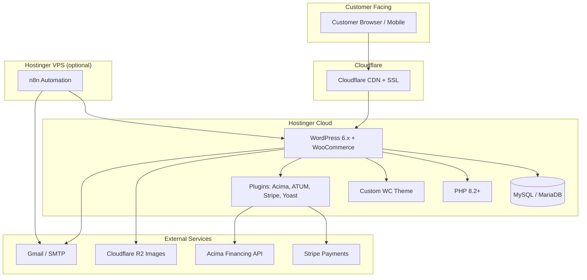
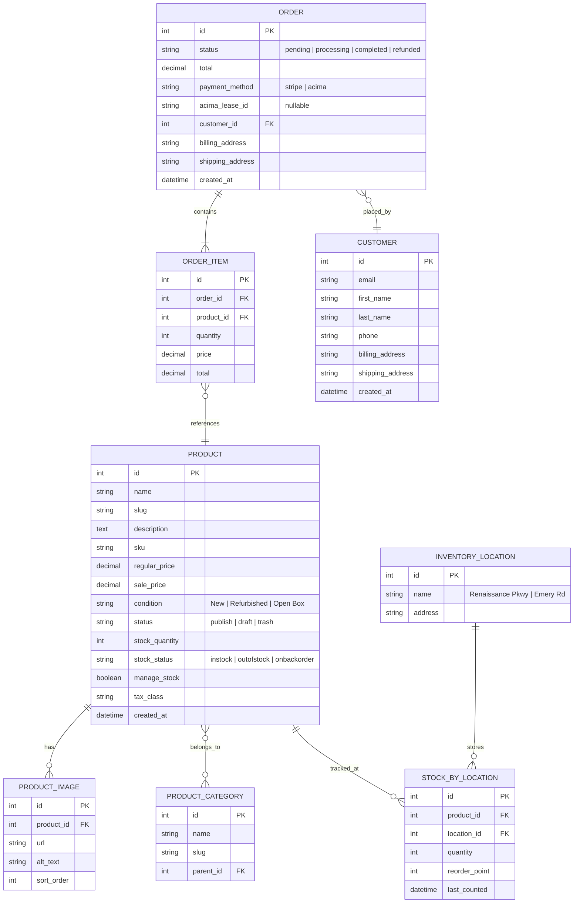

# Boom Warehouse — Product Requirements Document

> Version 1.0 | 2026-03-14 | Generated from PRD-PROMPT.md + Serena memory + Obsidian context

---

## Table of Contents

1. [Executive Summary](#1-executive-summary)
2. [Platform Decision](#2-platform-decision)
3. [Business Context](#3-business-context)
4. [User Personas](#4-user-personas)
5. [Core Features](#5-core-features)
6. [Technical Architecture](#6-technical-architecture)
7. [Hosting & Deployment](#7-hosting--deployment)
8. [Design Direction](#8-design-direction)
9. [Integration Surface](#9-integration-surface)
10. [Data Model](#10-data-model)
11. [Quality Gates](#11-quality-gates)
12. [Phase Plan](#12-phase-plan)
13. [Risks & Mitigations](#13-risks--mitigations)
14. [Success Metrics](#14-success-metrics)

---

## 1. Executive Summary

**Boom Warehouse** is a Cleveland-area retailer selling refurbished electronics, appliances, TVs, computers, furniture, and household goods from two physical locations. Their current website (boomwarehouse.com) is non-functional. They need:

1. A working e-commerce storefront where customers can browse, search, and buy products online
2. An inventory management system for warehouse staff to track stock across two locations
3. Integration with **Acima lease-to-own financing** (up to $5,000) — a key business differentiator for their price-conscious customer base

**Recommended approach:** WooCommerce on the existing Hostinger WordPress installation, with a custom theme matching the warehouse-industrial brand identity. This gets a live store operational in weeks instead of months, leverages the hosting the client already paid for, and has a proven Acima integration plugin.

---

## 2. Platform Decision

### Comparison

| Criteria | WooCommerce | Medusa.js | Custom Monorepo | Shopify Lite |
|----------|-------------|-----------|-----------------|-------------|
| **Time to live store** | 2-3 weeks | 6-8 weeks | 12-16 weeks | 3-4 weeks |
| **Monthly cost** | $0 (free plugin) | $0 (self-hosted) | $0 | $39/mo Shopify fee |
| **Acima integration** | Official plugin exists | Custom build needed | Custom build needed | Custom build needed |
| **Inventory (multi-location)** | Plugin available | Built-in | Custom build | Built-in |
| **Barcode scanning** | Plugin available | Custom build | Custom build | Shopify POS ($89/mo) |
| **Hosting** | Hostinger WordPress (already installed) | Hostinger Node.js | Hostinger Docker/Node | Shopify cloud + Hostinger for frontend |
| **Search** | WooCommerce search + plugins | Meilisearch | Meilisearch | Shopify search |
| **Payment processing** | Stripe + Acima plugins | Stripe (custom Acima) | Stripe (custom Acima) | Shopify Payments |
| **Agent autonomy** | High — WP-CLI, REST API | Medium — code required | Low — everything from scratch | Medium — API config |
| **Mobile experience** | Theme-dependent | Full control | Full control | Theme-dependent |
| **Customization ceiling** | Medium (PHP themes/plugins) | High | Unlimited | Low (locked to Shopify) |
| **Maintenance burden** | Low (plugin updates) | Medium | High (everything is yours) | Low |
| **SEO** | Excellent (Yoast, etc.) | Good (SSR) | Good (Next.js SSR) | Good |

### Recommendation: **WooCommerce** (Option A)

**Why:**

1. **Acima already has a WooCommerce plugin.** Building a custom Acima integration from scratch would take weeks and require their API docs (which may not be publicly available). The plugin just works.

2. **Hostinger already has WordPress installed.** Zero deployment work. The client is paying for this hosting regardless.

3. **Time to revenue matters.** A working store in 2-3 weeks vs. 12-16 weeks for custom. Every week without a store is lost revenue.

4. **Multi-location inventory plugins exist** (e.g., ATUM, WooCommerce Stock Manager). No need to build from scratch.

5. **The agent (Hermes/Droid) can operate WooCommerce autonomously** via WP-CLI and the REST API — creating products, managing inventory, configuring plugins, and deploying theme changes without manual intervention.

6. **Budget-friendly.** $0/mo for WooCommerce itself. Total operational cost stays under $38/mo (Hostinger hosting + Cloudflare free tier + Stripe per-transaction fees).

7. **Escape hatch.** If WooCommerce hits a ceiling later, WooCommerce data exports cleanly to any platform. Starting custom doesn't give you a working store while you build.

**What we lose:** Fine-grained frontend control (compared to custom Next.js) and the modern DX of a TypeScript monorepo. But the business needs revenue, not architecture.

### When to revisit this decision

Upgrade to custom/headless if:
- Monthly revenue exceeds $50K (justifies engineering investment)
- WooCommerce performance degrades under load (>500 concurrent users)
- Acima requires custom checkout flows the plugin can't handle
- Owner wants features that no plugin can provide

---

## 3. Business Context

### Company

| | |
|---|---|
| **Name** | Boom Warehouse |
| **Industry** | Refurbished electronics & appliance retail |
| **Website** | boomwarehouse.com (currently non-functional) |
| **Locations** | 2 physical warehouses |

### Locations

| Location | Address | Role |
|----------|---------|------|
| **Renaissance Pkwy** | 4554 Renaissance Pkwy, Warrensville Heights, OH 44128 | Primary warehouse + showroom |
| **Emery Rd** | 26055 Emery Rd B-1, Cleveland, OH 44128 | Secondary warehouse |

### Product Categories

| Category | Examples | Typical Price Range |
|----------|----------|-------------------|
| TVs & Displays | Samsung, LG, Vizio — refurbished/open box | $89 - $899 |
| Computers & Laptops | Dell, HP, Lenovo — refurbished | $149 - $799 |
| Appliances | Washers, dryers, refrigerators, microwaves | $199 - $1,499 |
| Furniture | Desks, chairs, shelving, mattresses | $49 - $699 |
| Small Electronics | Tablets, headphones, speakers, smart home | $19 - $299 |
| Household Goods | Kitchen, bathroom, cleaning, storage | $9 - $149 |

### Condition Grades

| Grade | Description | Price vs. New |
|-------|-------------|--------------|
| **New** | Factory sealed, full warranty | 15-30% below retail |
| **Refurbished** | Tested, cleaned, limited warranty | 30-60% below retail |
| **Open Box** | Opened/returned, original packaging, works | 20-40% below retail |

### Acima Lease-to-Own Financing

- **Provider:** Acima Credit (acima.com)
- **Max amount:** $5,000
- **Approval:** Soft credit check, instant decision
- **Terms:** 12-month lease, early buyout option
- **Target customer:** Budget-conscious shoppers who can't get traditional financing
- **Integration:** Official WooCommerce plugin available
- **Business impact:** Estimated 25-40% of checkouts will use Acima

---

## 4. User Personas

### Customer: "DeShawn" — Budget-Conscious Cleveland Shopper

- **Age:** 25-45
- **Device:** Primarily mobile (Android)
- **Goal:** Find quality refurbished electronics at prices he can afford
- **Pain point:** Can't get traditional financing; needs Acima
- **Behavior:** Searches Google, browses on phone during lunch, wants to see what's in stock before driving to the store
- **Key flows:** Search → Product detail → Check if Acima-eligible → Add to cart → Checkout with Acima OR visit store

### Warehouse Staff: "Marcus" — Inventory & Fulfillment

- **Role:** Receives shipments, photographs items, manages stock, fulfills online orders
- **Device:** Desktop at the warehouse + smartphone for barcode scanning
- **Goal:** Know exactly what's in stock, where it is, and ship orders same-day
- **Pain point:** No digital inventory system — uses paper/spreadsheets, items get lost between locations
- **Key flows:** Scan barcode → Add to inventory → Set condition/price → Photograph → Publish to store. Receive online order → Pick → Pack → Ship/Mark for pickup

### Owner: "Ray" — Business Operations

- **Role:** Owner, sets pricing, monitors sales, makes purchasing decisions
- **Device:** Desktop and phone
- **Goal:** Grow online sales, track which categories/conditions sell best, manage cash flow
- **Pain point:** No visibility into real-time sales or inventory value
- **Key flows:** View dashboard → Check daily orders/revenue → Review low-stock alerts → Adjust pricing → Approve Acima applications

---

## 5. Core Features

### Priority 1 — Launch (Weeks 1-3)

| Feature | Description | Platform |
|---------|-------------|----------|
| **Product Catalog** | Browsable product listings with images, condition badges, pricing, availability | WooCommerce core |
| **Product Search** | Full-text search with filters (category, condition, price range, location) | WooCommerce + search plugin |
| **Shopping Cart** | Add/remove items, quantity adjustment, stock validation | WooCommerce core |
| **Stripe Checkout** | Credit/debit card payments | WooCommerce Stripe plugin |
| **Acima Checkout** | Lease-to-own financing option at checkout | Acima WooCommerce plugin |
| **Mobile-Responsive Theme** | Warehouse-industrial branded theme, mobile-first | Custom WooCommerce theme |
| **Basic Inventory** | Product stock counts, low-stock indicators | WooCommerce core |
| **Order Management** | View/fulfill/track orders from WP admin | WooCommerce core |

### Priority 2 — Operations (Weeks 4-6)

| Feature | Description | Platform |
|---------|-------------|----------|
| **Multi-Location Inventory** | Track stock per-warehouse (Renaissance Pkwy vs. Emery Rd) | ATUM or WC Multi-Location plugin |
| **Barcode Scanning** | Scan items in/out of inventory via phone camera | ATUM or Barcode plugin |
| **Stock Transfers** | Move inventory between locations with audit trail | ATUM plugin |
| **Low-Stock Alerts** | Email/webhook when stock drops below reorder point | WooCommerce + n8n automation |
| **Order Notifications** | Customer email on order confirmation, shipping, delivery | WooCommerce emails + n8n |
| **Customer Accounts** | Registration, order history, saved addresses | WooCommerce core |

### Priority 3 — Growth (Weeks 7-10)

| Feature | Description | Platform |
|---------|-------------|----------|
| **Reporting Dashboard** | Sales by category, condition, location, period | WooCommerce Analytics + plugin |
| **SEO Optimization** | Meta tags, structured data (JSON-LD), sitemap, rich snippets | Yoast SEO plugin |
| **Wishlist** | Save products for later | YITH Wishlist plugin |
| **Product Reviews** | Customer ratings and reviews | WooCommerce core |
| **Bulk Product Import** | CSV upload for adding many products at once | WooCommerce built-in importer |
| **Pickup Option** | "Buy online, pick up in store" per-location | WooCommerce Local Pickup plugin |

### Priority 4 — Automation (Weeks 10+)

| Feature | Description | Platform |
|---------|-------------|----------|
| **n8n Workflows** | Automated restock alerts, order routing, reporting emails | n8n (self-hosted on Hostinger VPS) |
| **Google Shopping Feed** | Product feed for Google Shopping ads | WooCommerce Google Listings plugin |
| **Facebook/Instagram Shop** | Social commerce integration | WooCommerce Facebook plugin |
| **Abandoned Cart Recovery** | Email reminders for incomplete checkouts | AutomateWoo or Mailchimp plugin |

---

## 6. Technical Architecture



### Stack

| Layer | Technology | Notes |
|-------|-----------|-------|
| CMS / E-commerce | WordPress 6.x + WooCommerce 9.x | Core platform |
| Language | PHP 8.2+ | Hostinger provides this |
| Database | MySQL 8.0 / MariaDB | Hostinger managed |
| Theme | Custom WooCommerce theme | Navy/Orange/Charcoal warehouse brand |
| Payments | WooCommerce Stripe Gateway | Credit/debit cards |
| Financing | Acima WooCommerce Plugin | Lease-to-own checkout |
| Inventory | ATUM Inventory Management | Multi-location, barcode, transfers |
| SEO | Yoast SEO | Meta, structured data, sitemap |
| Images | Cloudflare R2 + CDN | Offload media for performance |
| SSL | Cloudflare + Let's Encrypt | Free SSL |
| Automation | n8n (Hostinger VPS, ~$7/mo) | Low-stock alerts, order workflows |
| Email | Hostinger SMTP or SendGrid free tier | Transactional emails |
| Analytics | Google Analytics 4 + WooCommerce Analytics | Sales and traffic reporting |

### WP-CLI for Agent Automation

Hermes/Droid can manage the entire store via WP-CLI over SSH:

```bash
# Product management
wp wc product create --name="Samsung 55\" 4K TV" --regular_price=349.99 --categories='[{"id":15}]'
wp wc product list --format=table

# Inventory
wp wc product update <id> --stock_quantity=5 --manage_stock=true

# Orders
wp wc order list --status=processing --format=table
wp wc order update <id> --status=completed

# Plugin management
wp plugin install woocommerce-gateway-stripe --activate
wp plugin update --all

# Theme deployment
wp theme activate boom-warehouse
```

---

## 7. Hosting & Deployment

### Current State (from Serena memory)

- **Plan:** Hostinger Business Web Hosting
- **Domain:** boomwarehouse.com (DNS not yet connected)
- **Preview URL:** https://darkseagreen-mallard-252962.hostingersite.com
- **Current install:** WordPress (placeholder, to be configured for WooCommerce)
- **Node.js support:** Available but not needed for WooCommerce approach
- **Daily backups:** Enabled
- **SSL:** Available via Hostinger + Cloudflare

### Deployment Strategy

| Component | Where | How |
|-----------|-------|-----|
| WordPress + WooCommerce | Hostinger Business Hosting | Already installed, configure via WP Admin + WP-CLI |
| Custom theme | Hostinger (wp-content/themes/) | Git push → SSH deploy script, or Hostinger Git integration |
| Product images | Cloudflare R2 | WP Offload Media plugin → R2 bucket |
| n8n automation | Hostinger VPS KVM 2 ($7/mo) | Docker container |
| DNS | Cloudflare | Free tier, proxy enabled |

### Monthly Costs

| Service | Cost |
|---------|------|
| Hostinger Business Hosting | ~$26/mo (already paid) |
| Hostinger VPS for n8n | ~$7/mo |
| Cloudflare (CDN + R2) | ~$0-5/mo (free tier covers most) |
| Stripe | 2.9% + $0.30/txn |
| Acima | Per Acima merchant agreement |
| WooCommerce + plugins | $0 (free plugins) |
| **Total fixed** | **~$33-38/mo** |

### Domain Connection Steps

1. Point boomwarehouse.com nameservers to Cloudflare
2. In Cloudflare, create A record → Hostinger server IP
3. In Hostinger hPanel, add boomwarehouse.com as primary domain
4. Enable Cloudflare proxy (orange cloud) for CDN + DDoS protection
5. Force HTTPS redirect in Cloudflare

---

## 8. Design Direction

### Brand Identity

| Element | Value |
|---------|-------|
| Primary color | Navy #1B3A5C |
| Accent color | Orange #E8792B |
| Text color | Charcoal #2D2D2D |
| Background | Off-white #F5F5F0 with subtle noise texture |
| Aesthetic | Warehouse-industrial — bold, gritty, real. NOT generic/corporate/clean. |
| Typography | Display: bold condensed for headings. Body: clean sans-serif. |

### Mobile-First Requirements

- **60%+ traffic expected on mobile** — design for 375px first, then scale up
- Thumb-friendly tap targets (min 44x44px)
- Product images fill viewport width on mobile
- Sticky "Add to Cart" bar on product pages
- Collapsible filters on category pages
- Fast loading: target LCP < 2.5s on 4G

### Key UI Elements

- **Condition badges:** Color-coded pills — Green (New), Blue (Refurbished), Amber (Open Box)
- **Stock indicators:** "In Stock" (green), "Low Stock — Only X left" (amber), "Out of Stock" (red)
- **Acima CTA:** Prominent "As low as $XX/mo with Acima" on every eligible product
- **Location selector:** "Available at: Renaissance Pkwy / Emery Rd / Both" on product cards
- **Price prominence:** Large, bold pricing. Show original retail price with strikethrough + savings %

### WooCommerce Theme

Custom theme built on top of a starter like Underscores (`_s`) or a lightweight base theme. NOT a purchased theme — those always look generic and are bloated with unused features.

Theme structure:
```
wp-content/themes/boom-warehouse/
├── style.css              (brand styles)
├── functions.php          (WC customizations)
├── woocommerce/           (template overrides)
│   ├── archive-product.php
│   ├── single-product.php
│   ├── cart/
│   └── checkout/
├── template-parts/
│   ├── product-card.php
│   ├── condition-badge.php
│   └── acima-cta.php
├── assets/
│   ├── css/
│   ├── js/
│   └── images/
└── inc/
    ├── wc-hooks.php       (WooCommerce hooks)
    └── acima-helpers.php
```

---

## 9. Integration Surface

### WooCommerce REST API (v3)

WooCommerce exposes a full REST API that Hermes/Droid/n8n can use:

| Endpoint | Methods | Purpose |
|----------|---------|---------|
| `/wp-json/wc/v3/products` | GET, POST, PUT, DELETE | CRUD products |
| `/wp-json/wc/v3/products/categories` | GET, POST, PUT, DELETE | Manage categories |
| `/wp-json/wc/v3/orders` | GET, POST, PUT, DELETE | Order management |
| `/wp-json/wc/v3/customers` | GET, POST, PUT, DELETE | Customer accounts |
| `/wp-json/wc/v3/reports/sales` | GET | Sales reporting |
| `/wp-json/wc/v3/reports/top_sellers` | GET | Best-selling products |
| `/wp-json/wc/v3/shipping/zones` | GET, POST | Shipping configuration |
| `/wp-json/wc/v3/taxes` | GET, POST | Tax configuration |
| `/wp-json/wc/v3/coupons` | GET, POST, PUT, DELETE | Discount codes |

### External Integrations

| Service | Integration | Auth |
|---------|-------------|------|
| **Stripe** | WooCommerce Stripe Gateway plugin | Stripe API keys in WP settings |
| **Acima** | Acima WooCommerce plugin | Merchant ID + API key |
| **Cloudflare R2** | WP Offload Media plugin | R2 access key |
| **n8n** | WooCommerce webhooks → n8n | Webhook secret |
| **Google Analytics** | GA4 plugin or GTM | Measurement ID |
| **Google Shopping** | WooCommerce Google Listings | Merchant Center account |

### Webhooks (for n8n automation)

| Event | Trigger | Action |
|-------|---------|--------|
| `order.created` | New order placed | Send confirmation email, notify staff Slack/SMS |
| `order.updated` | Status change | Update customer, trigger fulfillment |
| `product.updated` | Stock change | Check if below reorder point → alert |
| `product.created` | New product added | Push to Meilisearch index (if using) |

---

## 10. Data Model

WooCommerce uses WordPress's database schema with custom tables. Key entities:



Note: PRODUCT, ORDER, and CUSTOMER are native WooCommerce/WordPress tables (wp_posts + wp_postmeta, wp_woocommerce_order_items, wp_users). INVENTORY_LOCATION and STOCK_BY_LOCATION are added by the multi-location inventory plugin (ATUM).

---

## 11. Quality Gates

### Performance

| Metric | Target | Tool |
|--------|--------|------|
| LCP (Largest Contentful Paint) | < 2.5s | Lighthouse |
| CLS (Cumulative Layout Shift) | < 0.1 | Lighthouse |
| INP (Interaction to Next Paint) | < 200ms | Lighthouse |
| TTFB (Time to First Byte) | < 600ms | WebPageTest |
| Mobile PageSpeed score | > 80 | Google PageSpeed Insights |

### Reliability

| Metric | Target |
|--------|--------|
| Uptime | 99.5%+ (Hostinger SLA) |
| Checkout success rate | > 95% |
| Search response time | < 500ms |
| Image load (CDN) | < 1s |

### Testing Strategy

| Type | Tool | Coverage |
|------|------|----------|
| Visual regression | Percy or BackstopJS | Key pages: home, product, cart, checkout |
| E2E checkout | Playwright | Full Stripe + Acima checkout flows |
| Performance | Lighthouse CI | Run on every deploy |
| SEO audit | Screaming Frog + Yoast | Monthly crawl |
| Security | WPScan + Sucuri | Weekly scan |

### WordPress Hardening

- Disable XML-RPC
- Limit login attempts (Wordfence or similar)
- Hide WP version
- Enforce strong admin passwords
- Keep WP core, WooCommerce, and all plugins updated
- Regular backups (Hostinger daily + off-site weekly to R2)

---

## 12. Phase Plan

### Phase 1: Foundation (Week 1)
**Goal:** Working WordPress + WooCommerce on boomwarehouse.com

- [ ] Connect boomwarehouse.com DNS to Hostinger via Cloudflare
- [ ] Install and activate WooCommerce
- [ ] Install core plugins: Stripe Gateway, Yoast SEO, Wordfence
- [ ] Configure Stripe test mode
- [ ] Set up product categories (TVs, Computers, Appliances, Furniture, Electronics, Household)
- [ ] Add condition attribute (New / Refurbished / Open Box)
- [ ] Configure shipping zones (local pickup + local delivery)
- [ ] Configure Ohio sales tax
- [ ] Set up admin accounts (owner, staff)

### Phase 2: Theme + Products (Weeks 2-3)
**Goal:** Branded store with real products

- [ ] Build custom WooCommerce theme (Navy/Orange/Charcoal warehouse aesthetic)
- [ ] Implement condition badges, stock indicators, Acima CTA in theme
- [ ] Mobile-responsive layout (test at 375px, 390px, 768px, 1024px)
- [ ] Photograph and upload initial product inventory (aim for 50+ products)
- [ ] Write product descriptions with specs for top 20 products
- [ ] Configure Cloudflare R2 for image offloading
- [ ] SEO: meta titles, descriptions, JSON-LD product schema
- [ ] Install and configure Acima WooCommerce plugin
- [ ] Test Stripe + Acima checkout flows end-to-end
- [ ] **LAUNCH:** Go live with basic store

### Phase 3: Inventory Management (Weeks 4-6)
**Goal:** Multi-location inventory tracking for warehouse staff

- [ ] Install and configure ATUM Inventory Management
- [ ] Set up two locations (Renaissance Pkwy + Emery Rd)
- [ ] Import existing inventory data (CSV)
- [ ] Configure barcode scanning for intake
- [ ] Set reorder points for key products
- [ ] Train staff on inventory workflow
- [ ] Test stock sync between admin and storefront

### Phase 4: Automation + Operations (Weeks 7-8)
**Goal:** Automated workflows, less manual work

- [ ] Deploy n8n on Hostinger VPS
- [ ] Create workflows: low-stock alerts, new order notifications, daily sales summary
- [ ] Configure customer transactional emails (order confirmation, shipping, delivery)
- [ ] Set up abandoned cart recovery (email)
- [ ] Configure Google Analytics 4
- [ ] Install Google Shopping feed plugin

### Phase 5: Growth Features (Weeks 9-12)
**Goal:** Features that drive repeat business

- [ ] Customer accounts: order history, saved addresses, wishlist
- [ ] Product reviews and ratings
- [ ] "Buy online, pick up in store" flow
- [ ] Facebook/Instagram shop integration
- [ ] Coupon/discount code system
- [ ] Bulk product import workflow (CSV template for staff)

### Phase 6: Optimization (Ongoing)
**Goal:** Performance, SEO, and conversion optimization

- [ ] Performance audit: image optimization, caching (WP Super Cache or LiteSpeed), lazy loading
- [ ] A/B test checkout flow (Acima prominence, CTA placement)
- [ ] Expand product photography and descriptions
- [ ] Monthly SEO review (rankings, content gaps, backlinks)
- [ ] Monitor and respond to customer reviews

---

## 13. Risks & Mitigations

| Risk | Likelihood | Impact | Mitigation |
|------|-----------|--------|-----------|
| **Acima plugin doesn't meet needs** | Medium | High | Test in staging first. Fallback: embed Acima's hosted checkout via iframe/redirect. |
| **Hostinger performance under load** | Low | Medium | Cloudflare CDN caching, image offload to R2, WP caching plugin. Upgrade to Cloud if needed. |
| **WordPress security vulnerability** | Medium | High | Wordfence firewall, auto-updates, limited admin accounts, daily backups, Cloudflare WAF. |
| **Product data entry is slow** | High | Medium | Build CSV import template + bulk upload workflow. Train staff. Consider AI-assisted descriptions. |
| **Multi-location inventory plugin limitations** | Medium | Medium | Evaluate ATUM vs. alternatives in Phase 3 staging. Worst case: custom WP plugin with WC hooks. |
| **Owner/staff resistance to new system** | Medium | Medium | Simple training docs, keep admin UX familiar (WP admin is widely known). |
| **Mobile performance** | Medium | High | Mobile-first theme development, test on real devices, Lighthouse CI gating. |
| **Plugin conflicts** | Medium | Low | Use staging site for all plugin installs. Test combinations before production. |

---

## 14. Success Metrics

### Launch Metrics (Month 1)

| Metric | Target |
|--------|--------|
| Store live and accepting orders | Yes |
| Products listed | 50+ |
| Mobile PageSpeed score | > 80 |
| Checkout completion rate | > 60% |
| Uptime | > 99% |

### Growth Metrics (Months 2-6)

| Metric | Target |
|--------|--------|
| Monthly online orders | 50+ by month 3, 150+ by month 6 |
| Average order value | $150+ |
| Acima usage rate | 25-40% of checkouts |
| Organic search traffic | 500+ monthly visits by month 6 |
| Inventory accuracy | > 95% (physical count vs. system) |
| Customer return rate | > 15% repeat purchases |

### Operational Metrics (Ongoing)

| Metric | Target |
|--------|--------|
| Order fulfillment time | < 24 hours |
| Stock-out rate | < 5% of listed products |
| Support response time | < 4 hours |
| Site speed (LCP) | < 2.5s |

---

*Document generated 2026-03-14. Source: PRD-PROMPT.md + Serena memories (boom-warehouse/project_state, boom-warehouse/hosting, boom-warehouse/repo_patterns) + Obsidian BoomWarehouse.md*
